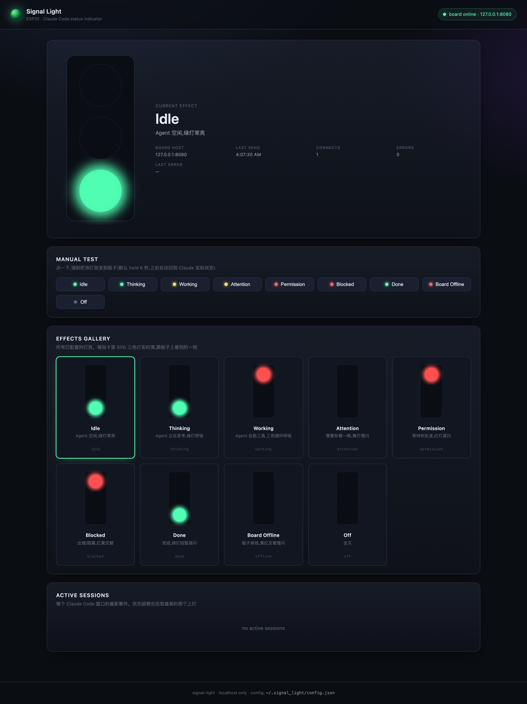
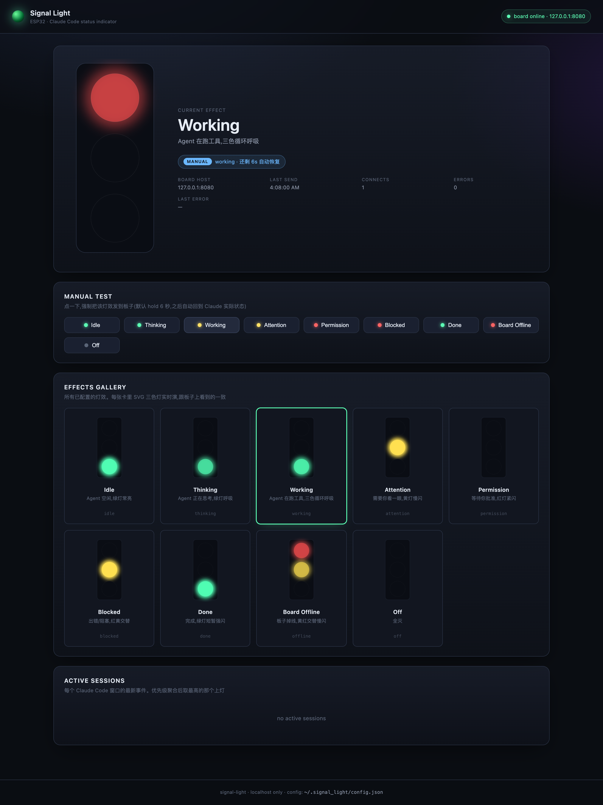

# ESP32-C3 Claude Code Status Light

A physical desk light that mirrors what your AI coding agent is doing.
Drop it next to your monitor, glance over once in a while: green idle, yellow
attention, red blocked, three-color pulse means it's still working.

Built around an **ESP32-C3 SuperMini** + a three-color (red/yellow/green) LED
board, wired over Wi-Fi to a local Python daemon that listens to **Claude Code**
and **Codex** hooks.




## Why

AI coding agents have moved out of the foreground. They run for minutes at a
time, spawn subagents, ask for permission, hit rate limits — and the only place
you can see any of it is the terminal you're not currently looking at.

This is a 30-LOC-of-cardboard solution: a tiny status light that lives on your
desk, drives itself off your agent's lifecycle hooks, and tells you at a glance
whether you should be paying attention or not.

## Architecture

```
┌────────────────────────────────┐
│  Claude Code / Codex hooks      │
│  (settings.json → hook_client)  │
└──────────────┬─────────────────┘
               │ HTTP POST (<100ms, always exits 0)
               ▼
┌────────────────────────────────┐
│  signal_daemon.py               │
│   - per-session state machine   │
│   - priority aggregation        │
│     (blocked > permission >     │
│      attention > working > idle)│
│   - frame scheduler             │
│   - Web UI on :7878             │
│   - long-lived TCP to ESP32     │
└──────────────┬─────────────────┘
               │ JSON-line over TCP (heartbeat + reconnect)
               ▼
┌────────────────────────────────┐
│  ESP32-C3 SuperMini             │
│  + tri-color LED module         │
│   - just plays the frame        │
│     sequence the daemon sends   │
│   - 30s watchdog reboot         │
└────────────────────────────────┘
```

The daemon owns all logic. The board is a dumb display: it receives JSON
frame sequences (`[{r, y, g, ms}, …]`) and plays them on loop until a new
sequence arrives. **Changing animations does not require re-flashing**.

## Hardware

What I used:

| Part | Notes |
| --- | --- |
| **ESP32-C3 SuperMini** (V1601) | USB-C, ~22.5 × 18 mm, native USB-Serial-JTAG so no driver needed on macOS |
| **Tri-color LED module** (common anode) | Salvaged from a toy traffic light. Common-anode with onboard 270/300 Ω limiting resistors. Any common-anode RGB module works |
| 3× ~330 Ω resistors | Optional. The LED module already has 270/300 Ω resistors; an extra series resistor brings the brightness down to "desk-friendly" |
| Hookup wire | I used 4 thin enameled wires |
| Soldering iron + multimeter | For wiring + verifying common-anode polarity |

Any ESP32 board with Wi-Fi (C3, S3, classic ESP32) will work — adjust the GPIO
pin numbers in the `.ino` file if your board doesn't expose 5/6/7.

### Wiring

The firmware assumes common-anode wiring (the most common topology for
multi-color modules). If your module is common-cathode, set `ACTIVE_LOW = false`
in the `.ino`.

```
ESP32-C3 SuperMini          LED module
─────────────────           ──────────
       3.3V ──────────────► common anode (any of the + pads)
       GND ───────────────► (only if your module has a separate GND pin)
       GPIO 5 ──[330Ω]────► red cathode   (RL−)
       GPIO 6 ──[330Ω]────► yellow cathode (YL−)
       GPIO 7 ──[330Ω]────► green cathode  (GL−)
```

With common-anode wiring, GPIO **LOW = LED on**, GPIO **HIGH = LED off**. The
firmware already inverts the PWM duty cycle for you (`ACTIVE_LOW = true`); just
double-check the polarity on your specific module before soldering. See the
*Verify polarity in 30 seconds* section below.

### Verify polarity in 30 seconds (no firmware needed)

Before soldering everything down:

1. Connect ESP32 `3.3V` to any LED `+` pad on the module.
2. Connect a 330 Ω resistor between ESP32 `GND` and one of the LED `-` pads.
3. Plug ESP32 into USB.

If the LED on that channel lights up, you have **common-anode**, and the
firmware is already configured correctly. If nothing lights up but lights up
when you swap `3.3V`/`GND` and use the `+` pad as the cathode, you have
**common-cathode** and should set `ACTIVE_LOW = false` in the `.ino` files.

## Flashing the firmware — step by step

This walkthrough uses `arduino-cli`. If you'd rather use the Arduino IDE GUI,
the equivalents are obvious (Tools → Board → ESP32C3 Dev Module, etc.).

### Prerequisites

```bash
# macOS
brew install arduino-cli

# Linux
curl -fsSL https://raw.githubusercontent.com/arduino/arduino-cli/master/install.sh | sh

# Windows (PowerShell, requires Scoop)
scoop install arduino-cli
```

Install the ESP32 board support package (one-time setup):

```bash
arduino-cli config init
arduino-cli config set board_manager.additional_urls https://espressif.github.io/arduino-esp32/package_esp32_index.json
arduino-cli core update-index
arduino-cli core install esp32:esp32
```

This pulls ~500 MB the first time. Subsequent installs are instant.

### Step 1 — Clone this repo

```bash
git clone https://github.com/lianshuang-photo/esp32-claude-status-light.git
cd esp32-claude-status-light
```

### Step 2 — Edit Wi-Fi credentials

Open `esp32c3_signal_light/esp32c3_signal_light.ino` and find:

```cpp
const WifiCred WIFI_NETWORKS[] = {
  { "YOUR_WIFI_SSID",      "YOUR_WIFI_PASSWORD"      },
  // { "Secondary_SSID",   "secondary_password"      },
  // { "Phone_Hotspot",    "hotspot_password"        },
};
```

Replace `YOUR_WIFI_SSID` / `YOUR_WIFI_PASSWORD` with your network. **You can
list multiple networks** — the board will try them in order on every reconnect
and stay on whichever one works first. Useful if:

- You move the board between home and office.
- You want a phone hotspot as a fallback.
- Your main router goes down and you have a backup AP.

Same edit applies to `esp32c3_signal_light_debug/esp32c3_signal_light_debug.ino`
if you want to flash the verbose version first (recommended).

### Step 3 — Plug the board in and find its USB port

Plug the ESP32-C3 into your computer with a USB-C cable (**data cable, not
power-only** — a lot of cheap USB-C cables are power-only and will silently
not enumerate the device).

```bash
# macOS / Linux
ls /dev/cu.* /dev/ttyUSB* /dev/ttyACM* 2>/dev/null
# Look for /dev/cu.usbmodem* or /dev/ttyACM*

# Windows
arduino-cli board list
```

On macOS the port typically looks like `/dev/cu.usbmodem101` or
`/dev/cu.usbmodem14201`. ESP32-C3 SuperMini has native USB-Serial-JTAG, so
**no driver install is needed** — it should show up immediately on plug-in.

If nothing shows up:
- Try a different USB cable. Power-only cables are a real problem.
- Try a different USB port (some hubs don't pass USB-C data).
- Hold `BOOT`, press and release `RST`, then release `BOOT` — this forces
  download mode on stubborn boards.

### Step 4 — Flash the debug firmware (recommended first)

```bash
arduino-cli compile --fqbn esp32:esp32:esp32c3 ./esp32c3_signal_light_debug
arduino-cli upload  --fqbn esp32:esp32:esp32c3 -p /dev/cu.usbmodemXXXX ./esp32c3_signal_light_debug
```

Replace `/dev/cu.usbmodemXXXX` with what you found in Step 3.

A successful upload looks like:

```
Writing at 0x00010000... (100 %)
Wrote 968637 bytes (567203 compressed) at 0x00010000 in 7.4 seconds (effective 1043.6 kbit/s)
Hash of data verified.
Leaving...
Hard resetting via RTS pin...
```

### Step 5 — Open the serial monitor and grab the IP

```bash
arduino-cli monitor -p /dev/cu.usbmodemXXXX --config baudrate=115200
```

You should see something like:

```
=== ESP32-C3 Signal Light DEBUG ===
[WIFI] trying #0 YourSSID
[WIFI] connected, IP=192.168.1.42
[TCP ] listening on port 8080
```

**Write down the IP.** Press `Ctrl+C` to exit the monitor.

If you see `[WIFI] trying #0 YourSSID` repeating but no `connected` — check
your SSID/password. Note that ESP32-C3 supports 2.4 GHz Wi-Fi only; 5 GHz-only
networks won't show up.

### Step 6 — Test it from your computer (no LED needed yet)

While the board is still on serial monitor, in another terminal:

```bash
# Replace 192.168.1.42 with your board's IP
nc 192.168.1.42 8080
```

Then paste this and press Enter:

```json
{"type":"effect","effect":{"id":"test","frames":[{"r":0,"y":0,"g":0,"ms":500},{"r":255,"y":0,"g":0,"ms":500}]}}
```

The serial monitor should print `[EFF ] 2 frame(s), f0=...` confirming the
board received and parsed your frame sequence. If you've already wired the LED,
the red light should start blinking at 1 Hz.

Press `Ctrl+C` to disconnect.

### Step 7 — Switch to the production firmware

Once everything works:

```bash
arduino-cli compile --fqbn esp32:esp32:esp32c3 ./esp32c3_signal_light
arduino-cli upload  --fqbn esp32:esp32:esp32c3 -p /dev/cu.usbmodemXXXX ./esp32c3_signal_light
```

This drops the verbose serial logging. Useful once you're past the wiring
stage.

## Running the daemon

The daemon is a single Python 3 file using only the standard library.

```bash
cd daemon
python3 signal_daemon.py
```

First run creates `~/.signal_light/config.json` with default settings, then
listens on `http://127.0.0.1:7878`. Open that URL in your browser.

Edit `~/.signal_light/config.json` and change `board.host` to your ESP32's IP
address (the one from Step 5 above). The daemon hot-reloads the file — no
restart needed.

```json
{
  "board": {
    "host": "192.168.1.42",
    "port": 8080,
    ...
  },
  ...
}
```

The top-right pill in the Web UI shows the board's connection status. Once it
goes green, the board is online and ready.

## Connecting Claude Code (and Codex)

```bash
cd daemon
# Dry-run: just print what it would change
python3 install_hooks.py

# Preview the merged settings.json in /tmp without touching the real file
python3 install_hooks.py --preview-merged

# Apply for real (always creates a .bak.<timestamp> backup first)
python3 install_hooks.py --apply

# Only install for Claude (skip Codex)
python3 install_hooks.py --apply --agent claude

# Uninstall later (leaves all other hooks alone)
python3 install_hooks.py --uninstall --apply
```

`install_hooks.py` tags its entries with `"_signal_light": true` so subsequent
runs are idempotent (`updated` not `added`), and uninstall only removes its
own entries.

After installing hooks, open a new Claude Code (or Codex) session — the
light should start responding within a second.

## Hook event coverage

The daemon handles every Claude Code hook event that has visual meaning, plus
the full Codex hook subset. See `docs/HOOK_EVENTS.md` for the complete table
(19 Claude events routed, 10 ignored on purpose, full Codex subset).

A few highlights of what's done well here that other status-light projects
miss:

- **`PostToolUse` reads `tool_response.error`** → a failed `Bash` command turns
  the light red even though the event name is `PostToolUse` (a success event
  on the surface).
- **`StopFailure` is routed by `error_type`** — `rate_limit` and `overloaded`
  go to a soft yellow, `billing_error` and `authentication_failed` go to red.
- **Per-tool bindings**: `PreToolUse:AskUserQuestion` lights up yellow
  attention instead of green working, so you immediately know Claude is
  waiting on you.
- **Multi-session priority aggregation**: a permission prompt in one window
  doesn't get hidden by another window starting work elsewhere.

## Web UI features

Open <http://127.0.0.1:7878> while the daemon is running:

- **Live mirror** — the big LED on the page tracks the physical light frame
  by frame.
- **8 effect cards** — every effect plays independently in its preview card,
  click any to push it to the board.
- **Manual test buttons** — same effects, but with a 6-second hold timer.
- **Demo scenarios** — four pre-canned scripts (Solo Claude / Two agents /
  Rush hour / Failures showcase) that simulate real agent activity so you can
  see what each state looks like without actually using Claude.
- **Profile switcher** — `vivid` (high-contrast demo profile) vs `calm`
  (desk-friendly default with single-color animations and softer timings).
- **Brightness slider** — global 5–100% scale applied to every effect.
- **Tempo toggle** — when on, work-state effects speed up as the number of
  concurrent sessions grows (1× → 3.5× capped). Off by default.
- **Agent filter** — `All` / `Claude` / `Codex` tabs change what gets
  aggregated for the light.
- **Session list** — every active session with cwd, last event, age, and a
  green-dot indicator on whichever one is currently driving the light.

## Configuration

`~/.signal_light/config.json` is auto-created on first run and contains:

- `board.host` / `board.port` — where to find the ESP32
- `server.host` / `server.port` — where the daemon listens (default 7878)
- `session.ttl_seconds` — how long an idle session stays in memory (default 120s)
- `display.profile` — `vivid` or `calm`
- `display.brightness` — 0.05 to 1.0
- `display.tempo_enabled` — boolean
- `effects[]` — the base effect definitions
- `profiles.<name>.overrides` — per-profile effect frame overrides
- `event_bindings` — `<event_name> → <effect_id>`
- `event_priority` — earlier entries beat later ones in multi-session aggregation
- `ignored_events` — events the daemon silently drops

Daemon hot-reloads the file on save. The Web UI also writes through to it for
profile/brightness/tempo changes.

## Troubleshooting

For a deep dive into every bug we hit while building this — wrong PWM,
LED stuck on after 11 blinks, USB-CDC silent serial, Wi-Fi reboot loops,
Codex not reloading hooks, and more — see [**docs/TROUBLESHOOTING.md**](docs/TROUBLESHOOTING.md).
It documents the real failure modes, why they happen on ESP32-C3 specifically,
and the exact fix for each.

Quick reference for the most common symptoms:

| Symptom | Likely cause | Fix |
| --- | --- | --- |
| Board doesn't show up as `/dev/cu.*` | Power-only USB cable | Use a data cable |
| Same, after trying multiple cables | Board needs forced download mode | Hold `BOOT`, press `RST`, release `BOOT` |
| Serial shows `[WIFI] trying #0` forever | Wrong SSID/password or 5 GHz-only network | ESP32-C3 is 2.4 GHz only |
| Web UI says "board offline" forever | Daemon `board.host` doesn't match the ESP32's actual IP | Edit `~/.signal_light/config.json`; daemon reloads on save |
| LED is always at full brightness | Wired common-cathode but `ACTIVE_LOW = true` | Set `ACTIVE_LOW = false` in `.ino`, re-flash |
| LED never turns on | Polarity reversed | Re-do the "Verify polarity in 30 seconds" test |
| Red and green swapped | Wired the wrong colors to GPIO 5/7 | Swap the `PIN_RED`/`PIN_GREEN` constants in `.ino`, re-flash; or just swap the wires |
| Light flickers visibly | Some buck converters create switching noise; or you're hitting Wi-Fi reconnect storms | Try a different USB power supply; check serial for `[WDG ]` reboot messages |
| Daemon stops driving the light after an hour | Process got killed | Set it up as a LaunchAgent (macOS) or systemd `--user` unit (Linux) — see `docs/AUTOSTART.md` *(not in this repo yet, ask if you want one)* |

## Repository layout

```
daemon/
├── signal_daemon.py        # HTTP/SSE server + scheduler + board client
├── board_simulator.py      # fake ESP32 over TCP, for hardware-free dev
├── hook_client.py          # thin hook forwarder (< 100 ms wall time)
├── install_hooks.py        # safe installer for ~/.claude and ~/.codex
├── config.default.json     # effect definitions, profiles, event bindings
├── codex.hooks.example.json
└── webui/
    ├── index.html
    ├── style.css
    └── app.js

esp32c3_signal_light/
└── esp32c3_signal_light.ino       # production firmware
esp32c3_signal_light_debug/
└── esp32c3_signal_light_debug.ino # verbose serial version

esp32c3_ai_status_led/             # legacy: video-reverse-engineered build,
esp32c3_ai_status_led_debug/       # kept for reference, do not use

claude_esp32_status_hook/          # legacy: original simple TCP-per-hook
                                    # design, superseded by daemon/
docs/
├── ui-idle.png
└── ui-working-override.png
```

## Credits and prior art

This started as an attempt to reproduce the build shown in a Xiaohongshu video
by **QStudio电子工作室**: "ESP32 实现 Claude code 状态指示灯" (note
`6a1978e50000000038037c42`). The original firmware was inferred from what was
visible in the video; that reconstruction now lives in `esp32c3_ai_status_led/`.

The current daemon-based design borrows heavily from two open-source projects
that solve the same problem differently:

- [starlight36/vibecoding-signal-light](https://github.com/starlight36/vibecoding-signal-light)
  — Rust + MCP2221A USB GPIO. Excellent multi-session priority logic and lamp
  language design.
- [Mittif/agent-signal-light](https://github.com/Mittif/agent-signal-light)
  — Python + CH552 USB HID. Strong Web UI / config editor and event-binding
  design.

Neither of those targets Wi-Fi ESP32, and neither does payload-driven failure
detection on `PostToolUse`. This project picks the best ideas from both, adds
the bits they miss, and adapts the whole thing to a wireless ESP32.

## License

MIT — see [LICENSE](./LICENSE).
